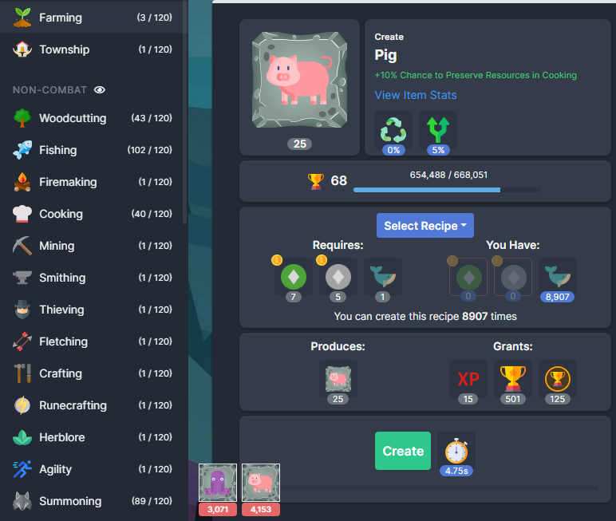
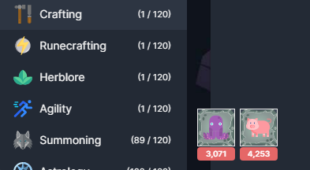
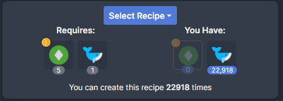
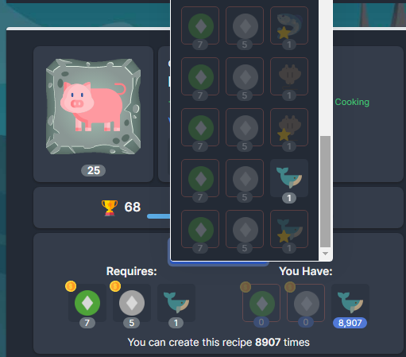
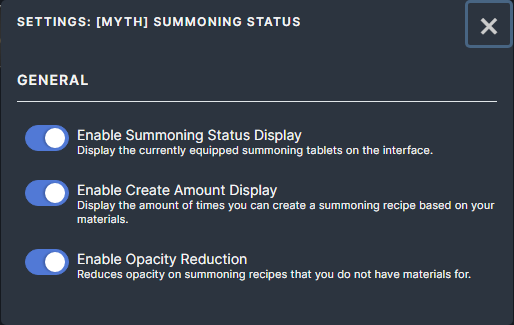

# [Myth] Summoning Status

This mod contains the following features:

## Summoning Status
Display summoning tablets in the bottom left of the screen so you can see it without needing to open the equipment screen.

The summoning status is only displayed on skills and the bank, it gets hidden on the shop, combat, golbin raid, completion log, lore, statistics and settings pages.

## Display Create Amount
Display how many times you can create the summoning recipe based on your current materials (ignores shards).

## Reduced Opacity
Reduces the opacity on recipes that you do not have any materials for. This makes it easier to locate recipes you do have materials for.

## Settings
All features of this mod can be enabled/disabled.

