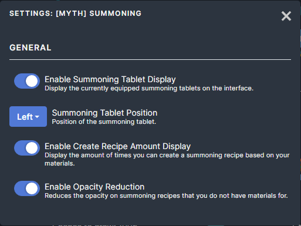

# [Myth] Summoning

This mod contains the following features:

## Summoning Status
Display summoning tablets in the bottom left of the screen so you can see it without needing to open the equipment screen.

## Display Create Amount
Display how many times you can create the summoning recipe based on your current materials (ignores shards).

## Reduced Opacity
Reduces the opacity on recipes that you do not have any materials for. This makes it easier to locate recipes you do have materials for.

## Settings
All features of this mod can be enabled/disabled.

